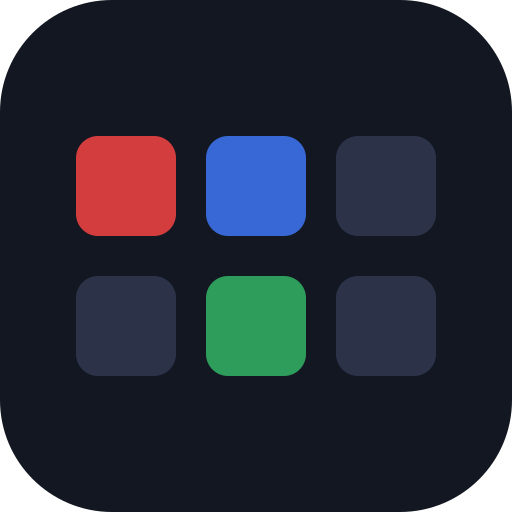
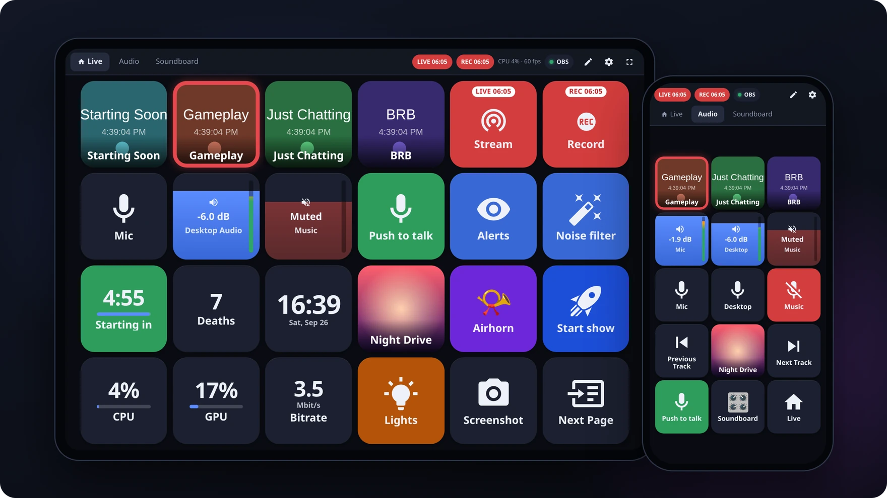
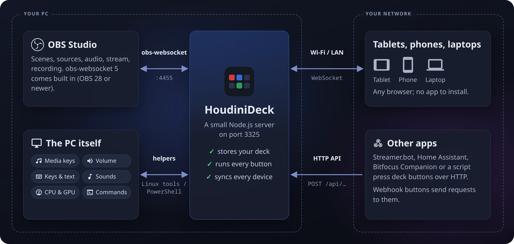
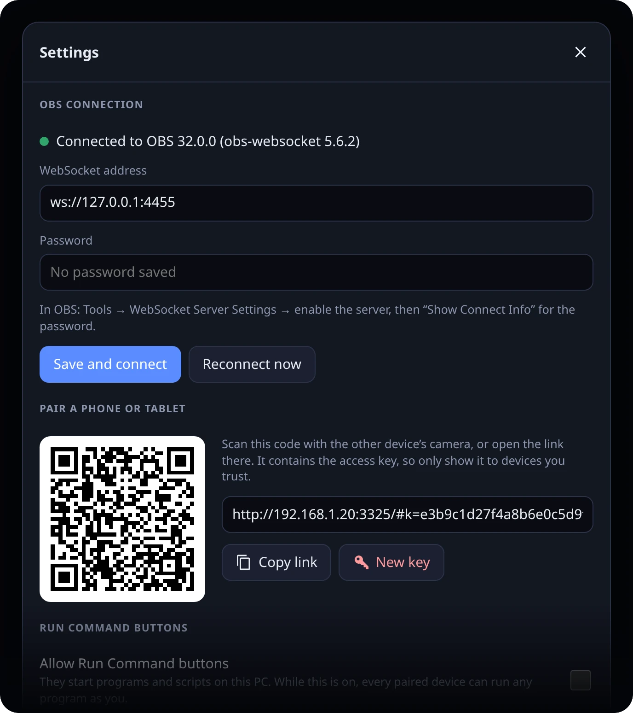
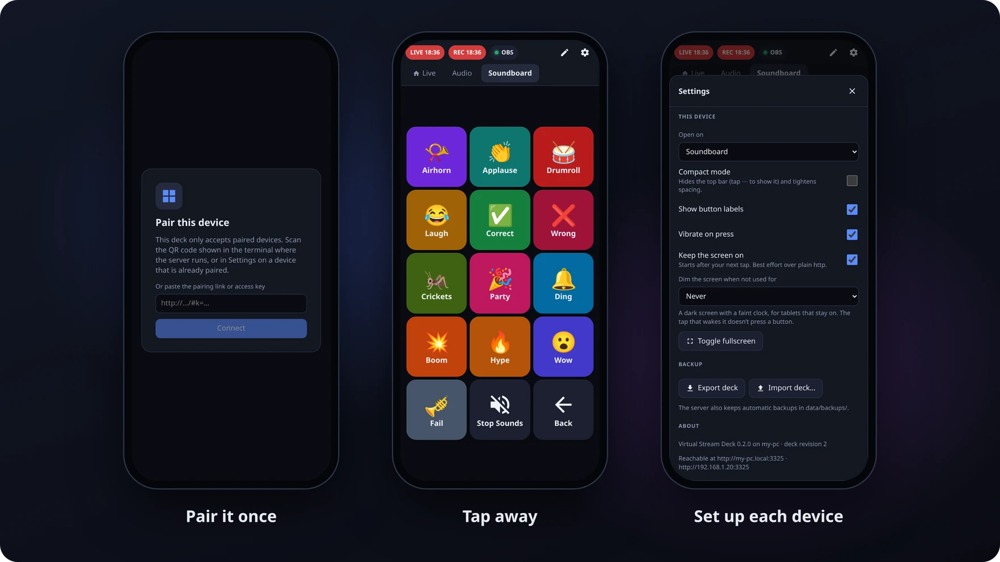
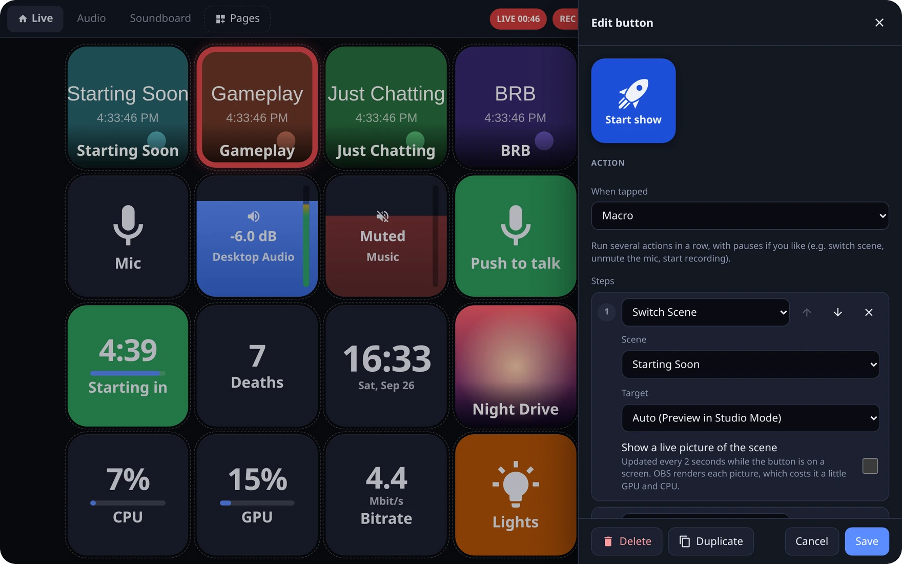
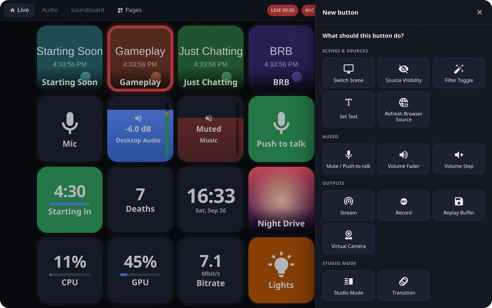

<div align="center">



# HoudiniDeck

**A virtual Stream Deck for OBS, in your browser.**

Turn any tablet, phone or laptop into a touch control panel for OBS Studio, your music, your PC and your smart home.<br>
It runs on your own PC (Linux or Windows 10/11), and every device on your network stays in sync.<br>
No account, no cloud, no app to install.

[](https://github.com/Houdini99/HoudiniDeck/releases/latest)
[](https://github.com/Houdini99/HoudiniDeck/actions/workflows/ci.yml)

[](LICENSE)

**[Download for Windows](https://github.com/Houdini99/HoudiniDeck/releases/latest)** · **[Download for Linux](#linux-appimage)** · [Quick start](#quick-start) · [Button types](#button-types) · [FAQ](#faq)



</div>

## Contents

- [Features](#features)
- [How it works](#how-it-works)
- [Quick start](#quick-start)
- [Install](#install): [Windows](#windows-installer) · [Linux](#linux-appimage) · [Linux from source](#linux-from-source) · [Windows from source](#windows-from-source) · [Updating](#updating) · [Uninstalling](#uninstalling)
- [Use it on a phone or tablet](#use-it-on-a-phone-or-tablet)
- [Using the deck](#using-the-deck)
- [Button types](#button-types)
- [Press buttons from other apps](#press-buttons-from-other-apps)
- [Configuration](#configuration): [Data and backups](#data-and-backups) · [Start automatically on login](#start-automatically-on-login)
- [Security](#security)
- [Troubleshooting](#troubleshooting)
- [FAQ](#faq)
- [Development](#development)
- [License](#license)

## Features

- 🎬 **Control OBS.**
  - Switch scenes, with Program and Preview highlighted in Studio Mode and, if you like, a live picture of the scene on the button.
  - Show and hide sources, toggle filters, set the text of a text source, and refresh browser sources (stuck alerts or chat).
  - Mute, push-to-talk and volume faders with live level meters.
  - Stream, record (pause, split, chapter markers), replay buffer and virtual camera.
  - Transitions, screenshots, hotkeys, media sources, scene collections and profiles.
  - Stream health tiles: dropped frames, bitrate, frame rate, OBS's CPU use and lag.
- 🎵 **Music and sounds.**
  - Media keys for whatever plays on the PC (Spotify, browsers, VLC, …), showing the song and its cover art.
  - A soundboard: MP3 or WAV clips play on the PC's speakers, so OBS hears them too.
- 🖥️ **Your PC.**
  - The PC's speaker and microphone volume.
  - Live CPU, memory and NVIDIA GPU tiles.
  - Keyboard shortcuts, which can stay held while you hold the button (push-to-talk in other apps).
  - **Type Text** for chat messages, and **Open Website**.
  - Any KDE Plasma global shortcut.
  - **Run Command** buttons, which start programs and scripts; they're off until you turn them on.
- ⏱️ **Timers and counters.**
  - Countdowns, stopwatches, counters (deaths, wins, …) and a clock, the same on every device.
  - They can write into an OBS text source ("Starting in 4:59", "Deaths: 12"), and they survive restarts.
- 🧩 **Macros and toggles.**
  - One button runs several actions in a row, with pauses.
  - A toggle runs one action on the first press and another on the next, and stays lit in between.
- 🔗 **Works with other apps.**
  - Webhook buttons call Home Assistant, Streamer.bot, a Philips Hue bridge or anything else with an HTTP API.
  - The other way round: Streamer.bot, Home Assistant, Bitfocus Companion or a script can press deck buttons.
- 🎛️ **A real deck.**
  - Any grid size, pages and folders.
  - Drag-and-drop editing from any device, with undo and redo; copy buttons and whole pages.
  - More than 10,000 icons (Material Design and brand logos), emoji, your own images and colors.
  - A different look while a button is active, long-press actions, and "tap twice" protection for the Stream button.
- 👆 **Made for touch.**
  - Buttons fire the moment you touch them, and hold-to-talk works.
  - Fullscreen or Add to Home Screen, a compact mode, and keep-the-screen-on.
  - Dimming after a few idle minutes; the tap that wakes the screen presses nothing.
- 🔒 **Locked down.**
  - Phones and tablets pair once with an access key (a QR code).
  - The OBS password is never sent to the browsers.
- ♻️ **Survives restarts.**
  - Buttons follow OBS's internal IDs, so renaming a scene doesn't break them.
  - The deck reconnects on its own when OBS restarts, and open tablets reload by themselves after an update.

## How it works



HoudiniDeck is a small server that runs on the PC with OBS. It keeps one connection to OBS (obs-websocket, which is built into OBS 28 and newer) and serves the deck as a web page.

Every tablet, phone or laptop that opens that page gets the same buttons, and whatever happens on one shows up on all of them.

Buttons that act on the PC itself use its own programs:

- **Linux:** small tools such as `playerctl`, `wpctl` and `ydotool`.
- **Windows:** a PowerShell helper that's part of the deck.

## Quick start

1. **Install and start HoudiniDeck** on the PC that runs OBS:
   - Windows: [run the installer](#windows-installer).
   - Linux: [download the AppImage](#linux-appimage).
2. **Open it on the PC** at <http://localhost:3325>. The Windows Start menu entry and a double-clicked AppImage open it for you.
3. **Connect OBS.**
   1. In OBS, open **Tools → WebSocket Server Settings**, tick **Enable WebSocket server** (keep authentication on), click **Show Connect Info** and copy the password.
   2. On the deck, open **Settings** (⚙), paste the password under *OBS connection* and click **Save and connect**.
4. **Get some buttons.** On an empty page, **Generate from OBS** creates buttons for your scenes, audio inputs and outputs. Or tap ✎ and **+** to build your own.
5. **Add your phone or tablet.** Allow the port through your firewall, then scan the QR code from **Settings → Pair a phone or tablet** with its camera. [Step by step](#use-it-on-a-phone-or-tablet)

<p align="center"></p>

## Install

You need:

- **A PC with Linux or Windows 10/11** that runs OBS.
- **OBS Studio 28 or newer.** It has obs-websocket 5 built in.
- **Node.js 24.2 or newer**, except with the Windows installer and the Linux AppImage, which bring their own. Node runs the server's TypeScript directly, so there's no build step for the server.

### Windows (installer)

Download `HoudiniDeck-Setup-<version>.exe` from the [latest release](https://github.com/Houdini99/HoudiniDeck/releases/latest) and run it. It brings its own Node.js, so there's nothing else to install.

- **"Windows protected your PC":** the installer isn't code-signed, so SmartScreen warns about it. Click **More info → Run anyway**.
- **Options while installing:**
  - let phones and tablets connect (a Windows Firewall rule, private networks only);
  - start HoudiniDeck when you log in;
  - a desktop icon.
- **Start it** from the Start menu (**HoudiniDeck**); it opens in your browser.
  - The terminal window that comes with it is the deck itself: closing it stops the deck.
  - Starting it again while it runs just opens the browser.
- **Your deck, settings and images** live in `%LOCALAPPDATA%\HoudiniDeck` (Start menu → **HoudiniDeck data folder**).
- **Programs:** media keys, system volume and keyboard shortcuts use Windows PowerShell, which every Windows has. The GPU tiles use `nvidia-smi`, which comes with the NVIDIA driver.

### Linux (AppImage)

One file that runs on most distributions: x86_64 with glibc 2.28 or newer (from about 2019 on). It brings its own Node.js, so there's nothing to build.

1. Download it and make it executable:

   ```bash
   mkdir -p ~/Applications
   curl -L -o ~/Applications/HoudiniDeck-x86_64.AppImage https://github.com/Houdini99/HoudiniDeck/releases/latest/download/HoudiniDeck-x86_64.AppImage
   chmod +x ~/Applications/HoudiniDeck-x86_64.AppImage
   ```

   Or download `HoudiniDeck-x86_64.AppImage` from the [latest release](https://github.com/Houdini99/HoudiniDeck/releases/latest) and mark it as executable (file manager → Properties → Permissions).
2. Start it:
   - **Double-click it** in the file manager. The deck starts in the background and opens in your browser; doing it again while it runs just opens the browser.
   - **Or run it in a terminal** (`~/Applications/HoudiniDeck-x86_64.AppImage`). It prints the addresses and the pairing QR code there, and Ctrl+C stops it.

- **Stop it:** `~/Applications/HoudiniDeck-x86_64.AppImage --stop`.
- **Your deck, settings and images** live in `~/.local/share/HoudiniDeck` (`--data` opens it). A `.env` file goes there too. Started from the desktop, the deck writes its messages to `houdinideck.log` in that folder.
- **Coming from a source install?** Stop both, then copy what's in its `data/` folder into `~/.local/share/HoudiniDeck`.
- **Programs:** the buttons that act on the PC use the same [programs](#programs-for-the-pc-buttons-linux) as a source install.

### Linux (from source)

For development, or to run the newest code from GitHub.

1. Install Node.js 24.2 or newer and git. On Arch or CachyOS:

   ```bash
   sudo pacman -S nodejs npm git
   ```

   On other distributions, use their package manager, or get Node.js from [nodejs.org](https://nodejs.org).
2. Get HoudiniDeck, build its web page and start it:

   ```bash
   git clone https://github.com/Houdini99/HoudiniDeck.git
   cd HoudiniDeck
   npm install
   npm run build
   npm start
   ```

### Programs for the PC buttons (Linux)

Optional, for the AppImage and source installs alike: the programs behind the buttons that act on the PC. OBS buttons need none of them.

| For | Program | On Arch / CachyOS |
|---|---|---|
| Media Keys | `playerctl` | `sudo pacman -S playerctl` |
| System Volume | `wpctl` | comes with PipeWire (WirePlumber) |
| Play Sound | `pw-play` (or `paplay`, `ffplay`) | comes with PipeWire |
| Keyboard Shortcut, Type Text | `ydotool` 1.0 or newer, and its service | `sudo pacman -S ydotool` (see below) |
| Type Text outside KDE Plasma | `wl-copy` | `sudo pacman -S wl-clipboard` |
| GPU tiles | `nvidia-smi` | comes with the NVIDIA driver |
| KDE Shortcut | `busctl` | comes with systemd |

`ydotool` types through the kernel, so it works on Wayland. Its service needs write access to `/dev/uinput`:

```bash
sudo pacman -S ydotool
pacman -Ql ydotool | grep service           # shows where its service unit is
systemctl --user enable --now ydotool       # if the unit is under /usr/lib/systemd/user
```

### Windows (from source)

For development, or to run the newest code from GitHub.

1. Install Node.js and git. In PowerShell (or the Command Prompt):

   ```powershell
   winget install OpenJS.NodeJS.LTS
   winget install Git.Git
   ```

   Then **close the terminal and open a new one**, so it finds `node`, `npm` and `git`.
   - Without winget: use the installers from nodejs.org and git-scm.com.
   - Without git: on GitHub, click **Code → Download ZIP**, unpack it, and open a terminal in that folder.
2. Get HoudiniDeck, build its web page and start it:

   ```powershell
   git clone https://github.com/Houdini99/HoudiniDeck.git
   cd HoudiniDeck
   npm install
   npm run build
   npm start
   ```

   If PowerShell says *"npm.ps1 cannot be loaded because running scripts is disabled on this system"*, allow scripts for your account once, then run the command again:

   ```powershell
   Set-ExecutionPolicy -Scope CurrentUser RemoteSigned
   ```

   Or use the Command Prompt (`cmd`), which doesn't have this restriction.
3. The first time the deck starts, Windows asks whether Node.js may use the network: allow it for **private networks**.

### Updating

- **Windows installer:** run the newer installer. It stops the deck and keeps your deck and settings.
- **Linux AppImage:** stop it (`--stop`), download it again with the same `curl` command, and start it. Your deck stays in `~/.local/share/HoudiniDeck`.
- **From source:** in the deck's folder, stop it (Ctrl+C), then run:

  ```bash
  git pull
  npm install
  npm run build
  npm start
  ```

Open tablets reload by themselves.

### Uninstalling

- **Windows installer:** open Settings → Apps → Installed apps → **HoudiniDeck** → Uninstall.
  - It removes the program, its shortcuts and its firewall rule.
  - It asks whether to delete your deck and settings too.
- **Linux AppImage:** stop it (`--stop`), then delete the AppImage, and `~/.local/share/HoudiniDeck` unless you want to keep your deck. If you set up [autostart](#start-automatically-on-login), delete `~/.config/autostart/houdinideck.desktop` too.
- **From source:** delete the folder. Your deck lives in its `data/` folder, so export it first (Settings → Backup) if you want to keep it. If you set up [autostart](#start-automatically-on-login), remove that too.

## Use it on a phone or tablet

Phones and tablets need the access key, which pairing gives them. The PC's own browser doesn't (see [Security](#security)).



1. **Allow the port through the firewall.**
   - **Linux with ufw** (CachyOS turns it on by default): allow your home network. Adjust the subnet if yours differs:

     ```bash
     sudo ufw allow from 192.168.1.0/24 to any port 3325 proto tcp comment 'HoudiniDeck'
     ```

     To use the deck over a VPN such as WireGuard too, add the same rule for its subnet (e.g. `10.8.0.0/24`).
   - **Windows:** with the installer's firewall option, this is done. Otherwise, the first time the deck starts, Windows asks whether Node.js may use the network; allow it for **private networks**.
     - Your home network must be set to private: Settings → Network & internet → your Wi-Fi or Ethernet → Network profile type: **Private**.
     - If you missed the question, run this in PowerShell as administrator:

       ```powershell
       New-NetFirewallRule -DisplayName 'HoudiniDeck' -Direction Inbound -Protocol TCP -LocalPort 3325 -Action Allow -Profile Private
       ```

2. **Pair the device.** Scan the QR code with the device's camera. It's in the terminal where the deck runs, and in **Settings → Pair a phone or tablet** on the PC or any paired device.
   - Or open the pairing link on the device.
   - The deck's address is `http://<the PC's name>.local:3325` (e.g. `http://my-pc.local:3325`), or the IP address printed at startup.
3. **Optional: add it to the home screen**, so it opens fullscreen like an app.
   - iPhone/iPad: Share → Add to Home Screen.
   - Android: ⋮ → Add to Home screen.

> [!NOTE]
> The deck needs a browser from 2023 or newer: iOS/iPadOS 16.2+, Chrome or Edge 111+, Firefox 113+, or a current Samsung Internet.

## Using the deck



- **Pages.**
  - Each device remembers its own page.
  - Switch pages with the tabs at the top, or with Open Page / Folder and Next / Previous Page buttons.
  - In edit mode, **Pages** adds, renames, resizes, reorders, copies and deletes pages, and picks the home page.
- **Edit mode (✎):**
  - Tap **+** to add a button, and tap a button to edit it.
  - Drag a button to move it, or drop it on a page tab to move it to that page. On touch screens, hold it for a moment and then drag.
- **Undo:** ↶ and ↷ in the top bar (or Ctrl+Z and Ctrl+Shift+Z) take back and redo the last edits, made on any device.
- **Looks:** each button can have an icon, emoji or image, colors, and a label at the top, middle or bottom. It can look different while it's active (live, muted, visible, …).
- **Long press:** a second action that runs when you hold a button for half a second.
- **Volume faders:** drag up or down to change the volume, and tap to mute.
- **Push-to-talk buttons** unmute only while you hold them. If the device drops off the network mid-press, the server mutes again.
- **Counters and timers:**
  - Tap to count, or to start and pause; a long press resets. New buttons come with that long press.
  - Other buttons and macro steps can change the same counter or timer: pick it under "Which counter" or "Which timer".
  - A countdown that ran out flashes until you tap it.
- **Sounds:**
  - Add a Play Sound button and upload an MP3 or WAV.
  - It plays on the PC's default speakers, so OBS hears it through Desktop Audio (and so do you).
  - "Listen here" in the editor plays it on the device you're editing on.
- **Live scene pictures:** tick "Show a live picture of the scene" on a Switch Scene button. OBS renders a small picture every 2 seconds while the button is on some screen, which costs it a little GPU and CPU.
- **This device:** Settings → This device sets, for that device alone:
  - the page it opens on;
  - compact mode, labels and vibration;
  - keep-the-screen-on and dimming.

## Button types



A new button starts with the question "What should this button do?". Pick a card, then fill in the details: the editor lists your scenes, sources, inputs and filters to choose from.

### OBS

| Button | What it does |
|---|---|
| Switch Scene | Shows a scene. In Studio Mode it goes to Preview first, or straight to Program if you like. Can show a live picture of the scene. |
| Source Visibility | Shows or hides a source in a scene or group. |
| Filter Toggle | Turns a filter on a source or scene on or off. |
| Set Text | Replaces what a text source shows, e.g. "Back in 5 minutes". |
| Refresh Browser Source | Reloads a browser source without its cache, e.g. when alerts or chat get stuck. |
| Mute / Push-to-talk | Mutes or unmutes an audio input, or holds to talk or to mute. |
| Volume Fader | Drag to change an input's volume, tap to mute. Shows a live level meter. |
| Volume Step | Raises or lowers an input by a fixed number of dB. |
| Stream | Starts or stops streaming, and shows LIVE and the stream time. Asks for a second tap, unless you turn that off. |
| Record | Starts, stops or pauses recording, splits the file or adds a chapter marker. |
| Replay Buffer | Starts or stops the replay buffer, or saves a replay. |
| Virtual Camera | Starts or stops the virtual camera. |
| Studio Mode | Turns Studio Mode on or off. |
| Transition | Sends Preview to Program, with the transition and duration you pick. |
| Screenshot | Saves a PNG of the program scene, or of a source, to the OBS folder in your Pictures. |
| Media Control | Plays, pauses, restarts or stops a media source, or skips to its next or previous item. |
| OBS Hotkey | Triggers any OBS hotkey action by name. |
| Scene Collection, Profile | Switches OBS to another scene collection or profile. |
| OBS Stats | A tile with dropped frames, bitrate, frame rate, OBS's CPU use or lag. |

### Music, sounds and your PC

| Button | What it does | On Linux, needs |
|---|---|---|
| Media Keys | Play/pause, next, previous or stop for music and videos on the PC (Spotify, browsers, VLC, …). Can show the song and its cover art. | `playerctl` |
| Play Sound | Plays an MP3 or WAV on the PC's speakers. A second press stops it, starts it over or plays it once more on top. | `pw-play`, `paplay` or `ffplay` |
| Stop All Sounds | Stops every sound the deck plays. | |
| System Volume | Mutes or changes the PC's speakers or microphone, or works as a fader. | `wpctl` |
| System Stats | A tile with the CPU load, memory in use, CPU temperature (Linux only), or NVIDIA GPU load, temperature or memory. | `nvidia-smi` for the GPU |
| Keyboard Shortcut | Presses keys on the PC, and can hold them while you hold the button. | `ydotool` |
| Type Text | Types a text into the window that has focus, and presses Enter if you like. | `ydotool`, plus KDE's clipboard or `wl-clipboard` |
| Open Website | Opens a web page in the PC's default browser. | |
| KDE Shortcut | Triggers any KDE Plasma global shortcut: Overview, a Spectacle screenshot, Mute Microphone, … | KDE Plasma (Linux only) |
| Run Command | Runs a command or starts an app on the PC. Off until you turn it on in Settings; see [Security](#security). | |

On Windows, all of these except KDE Shortcut work without installing anything.

### Timers, macros and more

| Button | What it does |
|---|---|
| Timer | A countdown or stopwatch. Tap starts and pauses, a long press resets. Can write the time into an OBS text source. |
| Counter | Counts deaths, wins, … Tap adds one, a long press resets. Can write the count into an OBS text source. |
| Clock | Shows the time of day, and the date if you like. |
| Macro | Runs up to 20 actions in a row, with pauses of up to 60 seconds. By default, it stops at the first step that fails. |
| Toggle | Runs one action on the first press and another on the next, and stays lit in between, e.g. lights on and off. |
| Webhook | Sends an HTTP request, e.g. to Home Assistant, Streamer.bot or a Philips Hue bridge. |
| Open Page / Folder, Back, Next / Previous Page | Move between pages. **New Folder** creates a page and a button that opens it. |

## Press buttons from other apps

Any program on your network that can send an HTTP request can press a deck button: Streamer.bot, Home Assistant (`rest_command`), Bitfocus Companion or a script. Open the button in the editor → **Press it from other apps** for the exact command, which looks like this:

```bash
curl -X POST -H "Authorization: Bearer <access key>" http://my-pc.local:3325/api/buttons/<button id>/press
```

- Add `?which=longPress` to run the button's long-press action.
- `GET /api/buttons` (with the same header) lists every button with its id, page and label.
- The access key is the one in the pairing link (`#k=…`). On the PC itself, `http://localhost:3325/…` works without it.
- In Windows PowerShell, type `curl.exe` instead of `curl`.
- Push-to-talk, faders, page navigation and display tiles can't be pressed this way.

## Configuration

Everything can be set in the deck's Settings. These environment variables override it:

| Variable | Default | Meaning |
|---|---|---|
| `PORT` | `3325` | Port the deck listens on |
| `HOST` | `0.0.0.0` | Interface to bind (`127.0.0.1` = this PC only) |
| `OBS_URL` | `ws://127.0.0.1:4455` | obs-websocket address |
| `OBS_PASSWORD` | – | obs-websocket password. When `OBS_URL` or `OBS_PASSWORD` is set, Settings can't change the connection |
| `STREAMDECK_DATA_DIR` | `./data` | Where the deck, settings and images are stored. The Windows installer's version always uses `%LOCALAPPDATA%\HoudiniDeck`, the AppImage `~/.local/share/HoudiniDeck` unless you set this |
| `LOG_LEVEL` | `info` | `debug`, `info`, `warn` or `error` |

The easiest place for them is a `.env` file (see [`.env.example`](.env.example)), on Linux and Windows alike:

- **From source:** in the project folder.
- **Windows installer:** in its data folder (Start menu → **HoudiniDeck data folder**); restart the deck afterwards.
- **Linux AppImage:** in `~/.local/share/HoudiniDeck`; restart the deck afterwards.

To set one for a single run instead: `PORT=4000 npm start` in bash, or `$env:PORT=4000; npm start` in PowerShell.

### Data and backups

```
data/                (Windows installer: %LOCALAPPDATA%\HoudiniDeck, AppImage: ~/.local/share/HoudiniDeck)
  deck.json          pages and buttons
  settings.json      OBS connection + access key (only you can read it)
  button-state.json  counter counts, running timers and which toggles are on
  uploads/           button images and sounds
  backups/           older deck.json versions (automatic, the last 20)
```

- **Settings → Backup** exports and imports the whole deck as a JSON file.
- A deck file that can't be read is renamed to `deck.json.corrupt-<time>` rather than overwritten.

### Start automatically on login

<details>
<summary><b>Windows, with the installer</b></summary>

Tick "Start HoudiniDeck when I log in" while installing. Run the installer again to change it.

</details>

<details>
<summary><b>Windows, from source</b></summary>

`deploy\windows\virtual-streamdeck.cmd` starts the deck like `npm start` does. Run `npm run build` once, then:

1. Press Win+R, type `shell:startup` and press Enter. The Startup folder opens.
2. Right-click `deploy\windows\virtual-streamdeck.cmd` in the project folder → **Show more options → Send to → Desktop (create shortcut)**, and move that shortcut into the Startup folder.
3. Optional: in the shortcut's **Properties**, set **Run** to **Minimized**.

The deck then runs in a terminal window after you log in; closing that window stops it. After updating the code, run `npm run build` and restart it.

</details>

<details>
<summary><b>Linux, with the AppImage</b></summary>

An autostart entry starts it with your desktop session (without opening the browser), so Run Command and Open Website buttons work too:

```bash
mkdir -p ~/.config/autostart
printf '[Desktop Entry]\nType=Application\nName=HoudiniDeck\nExec=%s --no-browser\n' ~/Applications/HoudiniDeck-x86_64.AppImage > ~/.config/autostart/houdinideck.desktop
```

To turn it off, delete `~/.config/autostart/houdinideck.desktop`. Updating the AppImage keeps it working, since the file name stays the same.

</details>

<details>
<summary><b>Linux, from source (systemd user service)</b></summary>

A systemd user unit is included. It assumes the project lives in `~/HoudiniDeck` (cloned into your home folder); edit `WorkingDirectory` if not.

```bash
npm run build
mkdir -p ~/.config/systemd/user
ln -sf "$PWD/deploy/virtual-streamdeck.service" ~/.config/systemd/user/virtual-streamdeck.service
systemctl --user daemon-reload
systemctl --user enable --now virtual-streamdeck.service
```

- **Logs:** `journalctl --user -u virtual-streamdeck -f`.
- **After updating the code:** `npm run build`, then `systemctl --user restart virtual-streamdeck`.
- **Run Command and Open Website** need your desktop session's variables. Plasma normally passes them to systemd. If the log warns that `WAYLAND_DISPLAY` is not set, run `systemctl --user import-environment WAYLAND_DISPLAY DBUS_SESSION_BUS_ADDRESS` and restart the service.
- **To remove it:** `systemctl --user disable --now virtual-streamdeck.service`, then delete `~/.config/systemd/user/virtual-streamdeck.service`.

</details>

## Security

The deck controls your stream, so it's locked down even on a home network:

- **Pairing:**
  - A device must present the **access key**. The QR code and the pairing link carry it in the URL fragment (`#k=…`), which browsers never send to the server.
  - The key is kept in the device's browser storage, never in a cookie. That way other websites can't use a paired browser to press buttons (no CSRF, no DNS-rebinding tricks).
  - **Settings → New key** logs out every other device.
- **The PC itself needs no key,** but only when the request both arrives over loopback and is addressed to `localhost`/`127.0.0.1`.
- **Other websites are refused:** WebSocket connections and uploads from a different origin are rejected.
- **Secrets stay on the server:** the OBS password is never sent to browsers, and `settings.json` is readable only by you (on Windows, its access list names only your account).
- **Uploads:** only real images are accepted (checked by content), and they're served with `nosniff` and a sandboxing CSP.
- **Run Command buttons are off by default.**
  - Turned on, they let every paired device run any program as you. So only the browser on the PC itself (`http://localhost`) can turn them on or off: **Settings → Run Command buttons**. Paired phones and tablets see the switch but can't use it. The choice is saved in `settings.json`.
  - While they're off, command buttons are dimmed and refused, and none can be added, changed or imported. Existing ones can still be moved, relabeled or deleted.
  - Commands run in your home folder, with `sh -c` on Linux and `cmd.exe /c` on Windows; the OBS password is kept out of their environment.
  - On Windows, **Start an app** runs e.g. `start "" "C:\Program Files\VideoLAN\VLC\vlc.exe"` or `notepad`; a PowerShell script needs `powershell -ExecutionPolicy Bypass -File C:\path\to\script.ps1`.
- **Webhooks:**
  - A paired device can make the PC send HTTP requests to any `http://` or `https://` address, including services on your network.
  - Headers (e.g. an API token) are saved in the deck, so every paired device and every backup file can read them.
- **Open Website** opens only `http://` and `https://` addresses, in your default browser (so with your logins). Like webhooks, any paired device can add such a button.
- **Keyboard Shortcut and Type Text** buttons type into whichever window has focus, a terminal included. Keep that in mind before you pair a device you don't fully trust.
- **The HTTP API** (`/api/buttons/…`) needs the access key, like pairing does, except from the PC itself. It presses buttons that are on the deck; it can't run anything else. Requests from other websites are refused.
- **Sounds:** only MP3 and WAV files are accepted (checked by content), and only files the deck stored itself are played.

> [!WARNING]
> Don't forward the port to the internet. For access away from home, use a VPN (e.g. WireGuard) into your home network.

## Troubleshooting

<details>
<summary><b>A phone or tablet can't open the deck</b></summary>

- Check the firewall (see [Use it on a phone or tablet](#use-it-on-a-phone-or-tablet)), and that both devices are on the same network.
- Windows: the network must be private, not public (Settings → Network & internet).
- If `<name>.local` doesn't resolve on that phone, use the IP address instead.
- **Windows says the port can't be used:** Hyper-V and WSL reserve ranges of ports. `netsh interface ipv4 show excludedportrange protocol=tcp` lists them; set `PORT` in `.env` to a port outside them.

</details>

<details>
<summary><b>OBS doesn't connect</b></summary>

- **"OBS rejected the password":** copy the password again from *Show Connect Info* in OBS into Settings.
- **"Can't reach OBS":** OBS isn't running, or its WebSocket server is off (Tools → WebSocket Server Settings).

</details>

<details>
<summary><b>Linux: media keys, keyboard shortcuts, sounds, volume</b></summary>

- **Media keys are dimmed:** no media player is running, or `playerctl` isn't installed. Run `playerctl -l` in a terminal: it should list your players.
- **Keyboard shortcuts do nothing:** the toast says whether `ydotool` is missing or its service isn't running. `ydotool key 29:1 29:0` in a terminal (taps Ctrl) should run without an error.
- **Type Text** pastes with Ctrl+V, which terminals don't take (they want Ctrl+Shift+V). It also replaces what you had copied.
- **Sounds don't play:** the toast names the problem. `pw-play /path/to/sound.mp3` in a terminal should play it; the deck also tries `paplay` and `ffplay`.
- **System volume buttons are dimmed:** `wpctl get-volume @DEFAULT_AUDIO_SINK@` should print the volume. If the deck runs as a systemd service, it needs to run as your user (it does with the included user unit).
- **Open Website does nothing (systemd service):** the browser needs your desktop session's variables; see [Start automatically on login](#start-automatically-on-login).

</details>

<details>
<summary><b>Windows: media keys, keyboard shortcuts, sounds, stats</b></summary>

- **Media keys are dimmed:** only players that show up in Windows' own media controls (next to the volume slider in the taskbar) can be controlled: Spotify, Chrome, Edge, Firefox and most others. VLC 3 doesn't show up there.
- **Keyboard shortcuts don't reach a program that runs as administrator** (OBS sometimes does): Windows doesn't let normal programs type into those. Start the deck as administrator too, or use an OBS Hotkey button instead. Some games with anti-cheat ignore typed keys.
- **"Windows PowerShell couldn't start the deck's helper":** media keys, system volume and keyboard shortcuts need it. The server log says why; `powershell -NoProfile -Command "$PSVersionTable.PSVersion"` should print 5.1. A company PC may block PowerShell scripts by policy.
- **The CPU temperature tile says n/a:** Windows has no standard way for programs to read it.
- **Sounds:** Windows plays MP3 and WAV through its built-in media player component (winmm), on the default speakers.

</details>

<details>
<summary><b>Linux AppImage</b></summary>

- **It doesn't start and mentions FUSE:** AppImages need FUSE. Install your distribution's `fuse3` package, or start it with `--appimage-extract-and-run`; it then unpacks itself into `/tmp` (about 170 MB) and reuses that.
- **Nothing seems to happen on a double-click:** check that the file is executable, and look at `~/.local/share/HoudiniDeck/houdinideck.log`.
- **"Port 3325 is already in use":** another copy runs, e.g. from the autostart entry or a source install. `--stop` stops one that runs from an AppImage.

</details>

<details>
<summary><b>The tablet's screen turns off</b></summary>

- Keep-the-screen-on needs one tap after the page loads.
- Over plain `http://`, browsers only allow a workaround, so also consider raising the tablet's auto-lock time.

</details>

## FAQ

<details>
<summary><b>Do I need an Elgato Stream Deck?</b></summary>

No. HoudiniDeck takes the place of the hardware: any screen with a browser becomes the deck.

</details>

<details>
<summary><b>Which devices work?</b></summary>

Anything with a browser from 2023 or newer: iPads and iPhones (iOS/iPadOS 16.2+), Android tablets and phones, laptops, and the PC itself. Old tablets that can't update their browser won't work.

</details>

<details>
<summary><b>Does it need the internet or an account?</b></summary>

No. Everything runs on your PC and your home network. Only the buttons you point at the internet use it, such as webhooks and websites, and so does cover art that a music player loads from the web.

</details>

<details>
<summary><b>Can I use several devices at once?</b></summary>

Yes. All devices show the same deck and the same state, live. Each one remembers its own page and its own display settings.

</details>

<details>
<summary><b>Can I use it away from home?</b></summary>

Yes, through a VPN into your home network (e.g. WireGuard). Allow the VPN's subnet through the firewall too. Don't forward the port to the internet.

</details>

<details>
<summary><b>Does it run on a Mac, or with other streaming apps?</b></summary>

The server runs on Linux and Windows 10/11, next to OBS Studio 28 or newer. A Mac can still open the deck in its browser, like any other device.

</details>

<details>
<summary><b>Where are my buttons, and how do I back them up?</b></summary>

In `deck.json` in the data folder. Settings → Backup exports and imports the whole deck, and the server keeps the last 20 versions by itself. See [Data and backups](#data-and-backups).

</details>

## Development

```bash
npm run dev:mock    # UI + server + a fake OBS: no OBS needed (http://localhost:5173)
npm run dev         # UI + server against your real OBS
npm test            # server and shared-logic tests (node:test)
npm run typecheck   # tsc + svelte-check
```

- **What `dev:mock` runs:**
  - A mock obs-websocket server on port 4456 (`server/dev/mock-obs.ts`), with scenes, sources, audio levels and outputs.
  - Its own data directory, `.data-mock/`.
  - To simulate OBS quitting and coming back, run `kill -USR2 <pid>`, or on any system `curl http://127.0.0.1:4457/toggle`. The mock prints the command at startup.
- **Dev server and phones:** Vite serves the UI on port 5173 and proxies `/ws`, `/api`, `/icons` and `/uploads` to the Node server on 3325. The firewall blocks 5173 for other devices, so use `npm start` (port 3325) to try a phone.
- **Plans:** what's done and what's next is in [docs/ROADMAP.md](docs/ROADMAP.md).

### Project layout

```
shared/   types, zod schemas and logic used by both sides
          (actions-meta.ts = action catalog, feedback.ts = how buttons look)
server/   Fastify HTTP + WebSocket hub, OBS bridge and state mirror, deck storage, mock OBS,
          action executors (actions/) and helpers for other programs such as playerctl (system/);
          on Windows, one PowerShell helper does their jobs (system/windows/)
web/      Svelte 5 app (deck, editor, settings)
tests/    node:test suites
deploy/   systemd user unit, the Linux AppImage (linux/appimage/); for Windows a start script and the installer (windows/installer/)
docs/     roadmap and the pictures in this README
.github/  CI: tests and a start-up check on Linux and Windows; building and trying the Windows installer and the Linux AppImage
```

### Adding a new kind of button action

1. **Schema:** add it to `ActionSchema` in `shared/schema.ts`.
2. **Editor entry:** add an entry to `ACTION_META` in `shared/actions-meta.ts` (label, category, icon, form fields, behavior).
3. **Executor:** handle it on the server. Each `type` prefix (`obs`, `http`, …) has one executor in `server/actions/`, and `server/actions/registry.ts` lists them all. OBS actions live in `server/obs/execute.ts`.
4. **Active state (optional):** if the button should light up, add a case to `actionStatus` in `shared/feedback.ts`. State from outside OBS goes into `ExtState` (`shared/ext-types.ts`), which the server pushes to every browser.

The editor, validation and multi-device sync pick it up automatically. Executors are told which button they run for (`ActionCtx`); state kept per button (counters, timers, toggles) lives in `server/button-state.ts`.

### Contributing

Issues and pull requests are welcome. Before you open a pull request, make sure `npm test` passes and `npm run typecheck` reports no errors or warnings. CI runs both on Linux and Windows.

## License

[MIT](LICENSE) © Houdini99

- The icons come from [Material Design Icons](https://pictogrammers.com/library/mdi/) (Apache 2.0) and [Simple Icons](https://simpleicons.org) (CC0). Brand logos remain their owners' trademarks.
- HoudiniDeck is an independent project. It isn't affiliated with or endorsed by Elgato or the OBS Project.
